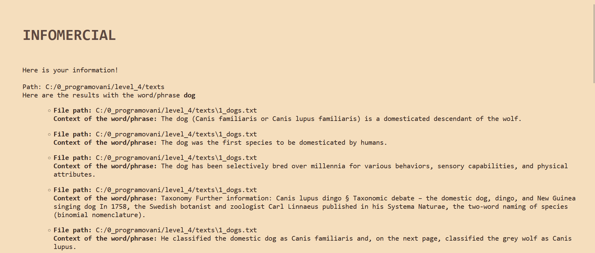

# UŽIVATELSKÁ DOKUMENTACE
**Infomercial** je jednoduchý program pro hledání slov a frází v doložených dokumentech. Po zadání hledaného slova prohledá dokumenty v předem dané složce a vrátí:
- cestu k souboru, ve kterém byla zadaná fráze nalezena
- kontext fráze

Cílem tohoto programu je napomoci prohledávání souborů a vracení vyhledávaných frází s jejich kontextem.

## ZÁKLADNÍ UŽITÍ
Užití stránky je následující: na úvodní stránce uživatel zadá do vyhledávacího pole (viz *Ukázka vyhledávací stránky*) frázi/slovo, které si přeje vyhledat, stránka tento dotaz zpracuje a vrátí věty ze souborů, ve kterých byl uživatelský dotaz nalezen, a jejich umístění (viz *Ukázka stránky s výsledky*).

Ukázka vyhledávací stránky:

Ukázka stránky s výsledky:

# PROGRAMÁTORSKÁ DOKUMENTACE

## ZÍSKÁNÍ 
Program je přístupný v souboru .py.

## DEPENDENCIES
Pro spuštění programu jsou potřeba následující knihovny:
- Flask - spouští server
- os - úprava cesty k dokumentům
- regex - umožňuje využití regulárních výrazů

## SPOUŠTĚNÍ
Program lze spustit v programu Visual Studio Code. 

## VENKOVNÍ POPIS ARCHITEKTURY

### Backend
popis backendu
popis kostry, obecný návrh
pokud máte objekty: popsat objekty, jejich cíl a veřejné metody
popis důležitých funkcí 

#### Funkce
- `get_files_in_folder(path_folder)`
    - funkce, která získá ze zadané cesty složky cesty k souborům v dané složce
    - input 
        - `path_folder`: cesta složky, ve které program prohledává soubory
    - return 
        - `file_paths`: cesty k souborům ve složce

    - ukázka:

- `get_text_from_txt_file(path_txt)`
    - funkce, která ze zadaného textového souboru vrátí čistý text
    - input
        - `path_txt`: cesta souboru, ze kterého získá funkce plain text
    - return
        - `text_from_file`: plain text obsažený v textovém souboru

- `find_context_of_phrase(request_phrase, raw_text)`
    - funkce, která nalézá pro zadanou frázi v zadaném textu kontext
    - kontext je tvořen větou, ve které se fráze nachází
    - input
        - `request_phrase`: zadaná fráze, jejíž kontext má být nalezen
        - `raw_text`: plain text, ve kterém je zadaná fráze s kontextem hledaná
    - return 
        - `contexts`: seznam stringů kontextů fráze

- `get_template_html(file_name)`
    - funkce, která z html dokumentu získá její obsah ve stringu pro následující načtení
    - input
        - `file_name`: cesta html souboru, který chceme načíst
    - return 
        - `result`: string obsahující text html dokumentu

- `fill_template(where, placeholder_name, fill_value)`
    - funkce, která pro zadaný html template vyplní placeholder zadaným parametrem
    - input
        - `where`: html template, ve kterém je zadaný placeholder nahrazen parametrem
        - `placeholder_name`: konkrétní název placeholderu, který je nahrazen parametrem
        - `fill_value`: parametr, kterým je nahrazen placeholder
    - return
        - `filled_template`: 

### Frontend
popis
jaké proměnné se zobrazují z python skriptu, jaký je účel

